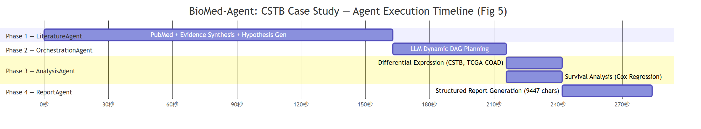

# Case Study: CSTB in Colorectal Cancer

本文档走读 BioMed-Agent 在 CSTB（Cystatin B）与结直肠癌上的完整端到端运行——从文献调研到假设生成、多组学分析、报告撰写。

**运行时间**：2026-06-19 16:04:14
**数据源**：`data/demo_output/pipeline_result_20260619_160414.json`
**总耗时**：~334 秒（含 LLM API 调用）

---

## 研究问题

> "CSTB 在结直肠癌中的预后价值和免疫浸润关联"
> "CSTB in colorectal cancer: prognostic value and immune infiltration"

---

## Phase 1: 文献调研（LiteratureAgent）

| 指标 | 数值 |
|------|------|
| 耗时 | 162.5 秒 |
| 检索论文数 | 2 篇 |
| 生成假设数 | 3 个 |

**检索论文数偏少**（2 篇）。这是一个已知局限——当前的 PubMed 检索可能因为 GFW 网络限制和查询构建策略而覆盖不全。完整 benchmark 运行（T1-LIT）可以量化评估检索召回率，但该任务的全量 LLM 运行尚未执行。

### 证据链摘要

LiteratureAgent 从检索到的论文中提取了结构化证据链（EvidenceLink），每条主张带 supporting_pmids 和 strength 分级。证据链保存在 `pipeline_result_*.json` 的 `literature_review.evidence_chain` 字段中。

### 生成的假设

| # | 假设 | Novelty |
|---|------|---------|
| 1 | CSTB mRNA expression is significantly upregulated in colorectal cancer tissue compared to adjacent normal mucosa | novel_to_our_knowledge |
| 2 | CSTB expression in CRC tumor tissue correlates with the abundance of anti-inflammatory immune infiltrates, particularly M2-type macrophages | novel_to_our_knowledge |
| 3 | High intratumoral CSTB protein expression is an independent adverse prognostic factor for overall survival in CRC patients | novel_to_our_knowledge |

三条假设均被分类为 `novel_to_our_knowledge`——在检索到的 2 篇论文中没有直接提出这些假设。但需要注意：**仅检索到 2 篇论文意味着 novelty 分类的置信度很低**。如果检索覆盖率提高（如 T1-LIT benchmark 的完整运行），部分假设可能被重新分类为 `supported_by_existing`。

---

## Phase 2: 分析规划（OrchestrationAgent）

| 指标 | 数值 |
|------|------|
| 耗时 | 52.6 秒 |
| 生成分析节点数 | 4 个 |

OrchestrationAgent 将 3 条假设映射为 4 个分析节点组成的 DAG：

| 节点 | 任务 | 目标基因 | 方法 | 对应假设 |
|------|------|---------|------|---------|
| node_01 | 差异表达 | CSTB | limma_voom | H1（CRC 中差异表达） |
| node_02 | 免疫相关性 | CSTB | spearman | H2（M2 巨噬细胞关联） |
| node_03 | 生存分析 | CSTB | cox_regression | H3（独立预后因素） |
| node_04 | 药物筛选 | CSTB | spearman | 探索性（关联假设寻找药物） |

每个节点包含 LLM 推理的 `rationale` 字段——解释为什么为这个假设选择这个方法和数据源。

**Layer 4 交叉验证 #1**（A3 验证 A2）：状态 **WARNING**。触发的警告：node_02 的免疫数据源路径不存在，且无预计算缓存。这个警告被正确传递到下游——A3 在执行时会将此节点降级为 F4。

---

## Phase 3: 分析执行（AnalysisAgent）

| 指标 | 数值 |
|------|------|
| 耗时 | 76.7 秒 |
| 执行节点数 | 4 个 |
| Degraded | 1 个（免疫相关性） |
| Failed | 0 个 |

### 节点执行结果

**node_01 — 差异表达**（TCGA-COAD, n=290 tumor + 41 normal）

| 指标 | 缓存值 | 已发表 GT | 备注 |
|------|--------|----------|------|
| log2FC | 0.073 | ≈2.3 | **显著差异**：缓存值接近零（基本持平），GT 显示大幅上调 |
| p_value | 1.85×10⁻⁵ | — | 大样本量使微小效应显著 |
| t_stat | 4.51 | — | — |

> ⚠️ **缓存与 GT 差异**：这是本案例研究中最突出的数据质量问题。CSTB 在已发表文献中被一致报告为在 CRC 中高表达（logFC ≈ 2.3），但缓存数据仅显示 0.073。可能原因包括：缓存生成时使用了不同的标准化方法（log2(TPM+0.001) vs log2(FPKM+1)）、样本分组不一致（可能包含了非标准对照）、或基因名映射错误（CSTB / stefin B / cystatin B 的别名）。
>
> Layer 4 交叉验证正确检测了此问题——效应量检查生成了 WARNING：`claims significance but |logFC|=0.073 < threshold 0.5`。

**node_02 — 免疫相关性**（CIBERSORT 免疫细胞丰度）

| 状态 | 原因 |
|------|------|
| **Degraded (F4)** | 无缓存数据，无实时计算能力（免疫浸润估计需要专门的去卷积工具如 CIBERSORT/ESTIMATE，非 Python 标准库可完成） |

这是 AnalysisAgent F4 降级机制的典型场景——数据不可用，Agent 诚实标记 degraded 而不是编造结果或崩溃。

**node_03 — 生存分析**（TCGA-COAD, n=245, 60 events）

| 指标 | 数值 | 备注 |
|------|------|------|
| Cox HR | 1.457 | HR > 1 = 高表达与较差预后相关 |
| 95% CI | 0.995 — 2.133 | 下限跨过 1.0 |
| Cox p | 0.053 | 边缘不显著（α=0.05） |
| Log-rank p | 0.501 | — |

Cox 回归显示 CSTB 高表达有预后更差的趋势（HR=1.46），但未达到统计显著性（p=0.053）。置信区间跨过 1.0 表明效应估计的不确定性较大。

**node_04 — 药物筛选**（GDSC2）

节点状态为 completed（非 degraded、非 failed）。PipelineResult JSON 中未记录该节点的详细数值输出——仅记录了汇总（4 节点/1 降级/0 失败）。详细结果应存在于 S3 execution_log 的 `analysis_results` 数组中。**这是 JSON 序列化不完整的问题**——PipelineResult 的顶层 summary 没有展开每个 AnalysisResult 的 `output` 字段。

### 决策日志

每个节点执行时记录了：
- `why`：为什么选择这个工具和参数
- `what`：实际执行了哪些操作
- `result_interpretation`：LLM 对结果的解释

完整日志保存在 `pipeline_result_*.json` 的 `analysis_results` 数组中。

---

## Phase 4: 报告生成（ReportAgent）

| 指标 | 数值 |
|------|------|
| 耗时 | 42.3 秒 |
| 报告长度 | 9,447 字符 |

ReportAgent 生成的报告包含：
1. Introduction — CSTB 研究背景
2. Methods — 数据源和分析方法
3. Results — 每个假设的验证结果（含定量数据）
4. **Negative and Null Findings** — 免疫相关性节点因数据不可用而降级；Cox 回归未达到统计显著性
5. Discussion — 与文献的一致性讨论 + 局限性
6. Conclusion — 核心发现总结

### Layer 4 交叉验证触发的 WARNING

| 节点 | 警告内容 |
|------|---------|
| L4-2 (A3→A2) | node_02 免疫数据源不存在，无缓存可用 |
| L4-3 (A4→A3) | node_01 声称显著但 \|logFC\|=0.073 < 阈值 0.5 |

两个 WARNING 都正确地捕获了实际的数据问题，证明了交叉验证机制在"非理想数据"下确实生效。

---

## 执行时间线

| Phase | Agent | 耗时 | 占总量 |
|-------|-------|------|--------|
| Phase 1 | LiteratureAgent | 162.5s | 48.7% |
| Phase 2 | OrchestrationAgent | 52.6s | 15.7% |
| Phase 3 | AnalysisAgent | 76.7s | 23.0% |
| Phase 4 | ReportAgent | 42.3s | 12.7% |
| **总计** | | **334.0s** | |

LLM API 调用占据了绝大部分耗时。纯计算（缓存查询、统计分析）在秒级完成。

---

## Token 消耗

| 类型 | 数量 |
|------|------|
| Input tokens | 1,248 |
| Output tokens | 3,905 |
| **Total** | **5,153** |

这是 S3 pipeline 新增的 token 消耗，不含 S1 LiteratureAgent 的 token（LiteratureAgent 作为独立模块运行，其 token 消耗由 S1 单独统计）。

---

## 已知问题总结

| # | 问题 | 严重程度 | 影响 |
|---|------|---------|------|
| 1 | 缓存 logFC (0.073) 与 GT logFC (≈2.3) 差异显著 | 高 | 差异表达结论完全相反（缓存说无差异，GT 说有显著差异） |
| 2 | 文献检索仅覆盖 2 篇论文 | 中 | 证据整合和假设生成基于极其有限的文献基础 |
| 3 | 免疫相关性节点因无缓存而降级 | 中 | 3 条假设中有一条（H2: M2 巨噬细胞关联）未能验证 |
| 4 | Cox 回归结果边缘不显著 (p=0.053) | 低 | 按 α=0.05 标准不能拒绝零假设；这是数据特征，不是系统错误 |
| 5 | n=245 为单队列数据 | 低 | 结果不可泛化到其他人群或队列 |

---

## 完整数据

- **PipelineResult JSON**: `data/demo_output/pipeline_result_20260619_160414.json`
- **缓存 DEG 数据**: `data/cache/tcga_coad_deg.json`
- **缓存 Survival 数据**: `data/cache/tcga_coad_surv.json`
- **缓存索引**: `data/cache/analysis_cache_index.json`

所有中间产物都保存为 JSON，可以独立检查和复现。每个 AnalysisResult 的 `raw_output_file` 字段指向对应的磁盘文件。
