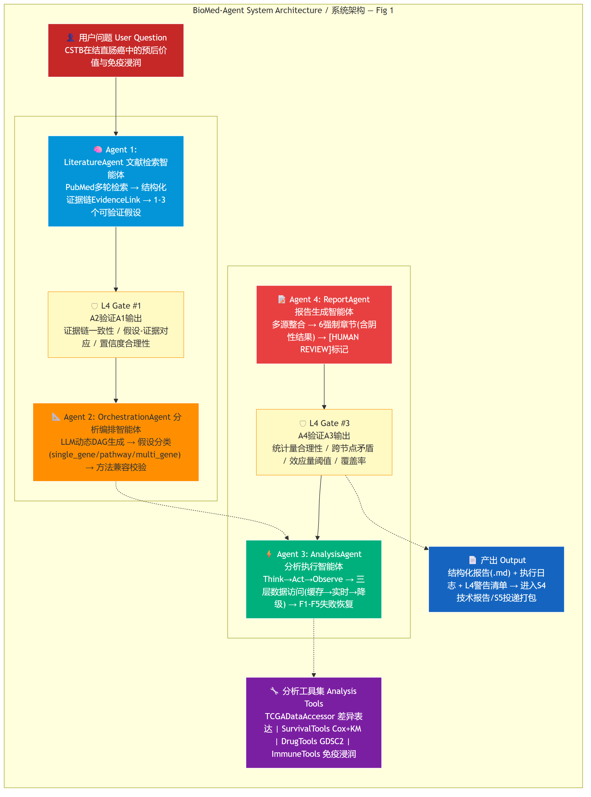

# BioMed-Agent

**A multi-agent system for biomedical literature-grounded multi-omics analysis.**

BioMed-Agent connects automated literature review with multi-omics data analysis through four collaborating agents: LiteratureAgent (PubMed retrieval + structured evidence synthesis), OrchestrationAgent (LLM-driven dynamic analysis planning), AnalysisAgent (multi-omics execution with failure recovery), and ReportAgent (evidence synthesis with cross-validation). A five-layer anti-hallucination defense spans prompt engineering, structural constraints, post-hoc verification, cross-agent validation, and human review checkpoints.



---

## 🚀 Quick Start

```bash
git clone https://github.com/Tubo2333/biomed-agent
cd biomed-agent
pip install -r requirements.txt
python demo/run_literature_review.py "CSTB in colorectal cancer prognosis"
```

This runs the LiteratureAgent — it searches PubMed, ranks papers by relevance, synthesizes a structured evidence chain, and generates testable hypotheses. Output is written to `data/demo_output/`.

To run the full four-agent pipeline:

```bash
python demo/run_pipeline.py "CSTB in colorectal cancer prognosis and immune infiltration"
```

This takes ~5-6 minutes (most of which is LLM API time) and produces a `PipelineResult` containing literature review, analysis plan, multi-omics results, and a structured scientific report.

---

## Reproducing This Work

This project is a **research reference system** — not a pip package, not a SaaS product. It is a complete vertical demonstration: design → implementation → evaluation → case study → technical report. The value is in the full picture, not in one-click execution.

### What works out of the box

```bash
# Structural tests — zero external dependencies beyond numpy
pip install numpy
python -m pytest tests/ -v --tb=short \
    --ignore=tests/test_s1_agent.py \
    --ignore=tests/test_s1_rag.py \
    --ignore=tests/test_runner.py \
    --ignore=tests/test_adversarial.py
```

This runs ~130 tests covering data model integrity, hallucination detector rules, benchmark metrics, and tool compatibility checks. No network, no LLM, no proxy required.

### What needs configuration

To run the full end-to-end pipeline or benchmark:

| Requirement | Why | How |
|-------------|-----|-----|
| **LLM API access** | All Agent reasoning (Literature, Orchestration, Analysis, Report) uses LLM calls | Set `ANTHROPIC_AUTH_TOKEN` and `ANTHROPIC_BASE_URL` environment variables, or configure `~/.claude/settings.json`. Default model: DeepSeek v4-pro via Anthropic SDK. Swap `src/llm/client.py` if using a different provider. |
| **Proxy (optional)** | Only needed if your network blocks PubMed/LLM API | Set `BIOMED_PROXY_HOST=127.0.0.1` and `BIOMED_PROXY_PORT=7892`. If not set, all network calls go direct — no proxy check. |
| **Pre-computed analysis cache** | AnalysisAgent reads DEG and survival results from `data/cache/*.json` | Cache files for CSTB/TCGA-COAD are included. To add your own gene or dataset: run the analysis externally (R/Python), save results in the cache JSON format (see `data/cache/analysis_cache_index.json` for schema), and re-run the pipeline. Without cache, AnalysisAgent degrades to F4 for that node — it will not fabricate data. |

### Environment-specific notes

- **GFW users (China)**: Set `BIOMED_PROXY_HOST` and `BIOMED_PROXY_PORT`. PubMed API and LLM endpoints are blocked without a proxy.
- **Non-GFW users**: No proxy needed. Leave `BIOMED_PROXY_*` unset — network calls go direct.
- **Windows users**: `Rscript -e` segfaults on this platform. That's why AnalysisAgent uses pre-computed caches instead of calling R live. If you need live R execution, use Linux/macOS.
- **Using a different LLM**: Edit `src/llm/client.py` to swap the Anthropic SDK for OpenAI, LiteLLM, or your preferred provider. The LLM client is ~250 lines and isolated from the rest of the system.

---

## What It Does

| Agent | Role | Input | Output |
|-------|------|-------|--------|
| **LiteratureAgent** | Multi-round PubMed search → evidence chaining → hypothesis generation | A biomedical research question | `LiteratureReview` (evidence chain + 1-3 hypotheses + knowledge gaps) |
| **OrchestrationAgent** | LLM-driven dynamic analysis DAG generation | `LiteratureReview` | `AnalysisPlan` (a DAG of analysis nodes, not a fixed template) |
| **AnalysisAgent** | Think→Act→Observe multi-omics execution with F1-F5 failure recovery | `AnalysisPlan` + real data | `AnalysisResult` list (each with `why`/`what`/`result` decision logs) |
| **ReportAgent** | Multi-source synthesis + Layer 4 cross-validation + structured reporting | All upstream outputs | Markdown report (with mandatory negative/null findings section) |

The pipeline is **serial by design** — each agent validates its upstream input before proceeding (Layer 4 cross-validation). This mirrors the natural scientific workflow (literature review → design → experiment → write-up) and ensures errors don't propagate silently.

---

## Anti-Hallucination: Five Defense Layers

Hallucination is especially dangerous in biomedical contexts. BioMed-Agent implements five layers:

| Layer | Mechanism | Where |
|-------|-----------|-------|
| **L1** Prompt | 5 hard constraints embedded in every LLM system prompt (no fabrication, source attribution, uncertainty expression, quantitative precision, negative results) | All prompt templates |
| **L2** Structural | `EvidenceLink` dataclass enforces: every claim must have supporting PMIDs; `strength="strong"` with counter-evidence is rejected at init | `src/types.py` |
| **L3** Post-hoc | Programmatic verification: PMID existence, gene name validity, statistical sanity (HR 0.01-100, p 0-1), cross-claim consistency | S1 synthesizer, S2 hallucination detector |
| **L4** Cross-validation | Three `validate_upstream()` nodes: A2 checks A1 (evidence internal consistency), A3 checks A2 (data source existence), A4 checks A3 (statistical sanity + cross-node contradiction + effect size) | S3 pipeline, report agent |
| **L5** Human | Outputs with `hallucination_rate > 0.1` or `strength="strong"` claims are flagged `[HUMAN REVIEW RECOMMENDED]` | All final outputs |

---

## Engineering Infrastructure

```
┌─────────────────────────────────────────────────────────────┐
│                     REST API (FastAPI)                       │
│  POST /analysis          GET /analysis/{id}                 │
│  GET /analysis/{id}/report    GET /analysis (list)          │
│  GET /stats              GET /health                        │
├─────────────────────────────────────────────────────────────┤
│                    Storage Layer (SQLite)                    │
│  ┌──────────┐   ┌──────────────┐   ┌──────────────────┐    │
│  │  tasks   │   │ task_results │   │   cache_stats    │    │
│  │ status   │   │ agent_output │   │ hits/misses/rate │    │
│  │ tokens   │   │   (JSON)     │   │      TTL         │    │
│  └──────────┘   └──────────────┘   └──────────────────┘    │
├─────────────────────────────────────────────────────────────┤
│              Structured Logging (JSON Lines)                 │
│  logs/<agent>.jsonl — agent_start/end, llm_call, errors     │
│  Auto-rotation by date, 30-day retention                    │
├─────────────────────────────────────────────────────────────┤
│              Config (config.yaml + env overrides)            │
│  BIOMED_LLM_MODEL, BIOMED_API_PORT, BIOMED_PROXY_HOST, ...  │
└─────────────────────────────────────────────────────────────┘
```

All components are zero-config by default. Run `python -m uvicorn src.api.main:app` to start the API server. Configuration via `config.yaml` with environment variable overrides (`BIOMED_<SECTION>_<KEY>`).

---

## Benchmark

We designed a standardized evaluation framework for biomedical agent capabilities: **5 tasks × 4 metrics × 4 baselines**.

Preliminary comparison on T3-DEG (differential expression analysis, TCGA-COAD):

| Agent | Overall Score | Hallucination Flags | Status |
|-------|--------------|---------------------|--------|
| B1 Naive LLM (zero-shot) | 0.637 | 1 | Completed (refused — correctly identified no data access) |
| B2 ReAct | — | — | Crashed (DeepSeek API tool-calling incompatibility) |
| B3 Simple RAG | 0.575 | 8 | Completed (single-round PubMed search) |
| B4 Domain ReAct | — | — | Crashed (same API incompatibility as B2) |
| **BioMed-Agent S3 Pipeline** | — | — | Degraded (pipeline designed for end-to-end case studies, not single-task benchmark mode) |

**Important context on these numbers**:
- This is a single-task comparison on one dataset (TCGA-COAD). Not generalizable.
- B2/B4 crashes stem from DeepSeek's Anthropic-format API not fully supporting native tool-calling — BioMed-Agent avoids this by using in-process Python tools.
- The S3 pipeline's degraded status in benchmark mode is expected: the pipeline's Task Router dispatches by `task_id` — T3-DEG/T4-SURV/T5-DRUG skip Phase 1 (LiteratureAgent) and go directly to Phase 2+3 with only the task input dict. The pipeline was built to answer open-ended research questions (`"study CSTB in CRC"`), not to score well on isolated single-task benchmarks. Its end-to-end capability is shown in the CSTB case study, not here.
- Full agent×task matrix benchmark (~150K tokens) has not been executed. The framework is designed and implemented (102 structural tests passing); the T3-DEG comparison above is the only quantitative cross-agent data available.

See [BENCHMARK.md](BENCHMARK.md) for task definitions, ground truth construction methodology, metric formulas, and known evaluation limitations.

---

## Project Structure

```
biomed-agent/
├── src/
│   ├── types.py              # Shared dataclasses (Paper, EvidenceLink, Hypothesis, etc.)
│   ├── llm/client.py         # Unified LLM client (DeepSeek v4-pro, temperature=0.3)
│   ├── utils/network.py      # Proxy detection + retry
│   ├── rag/                  # S1: Literature RAG pipeline
│   │   ├── retriever.py      #   PubMed EUtils + caching
│   │   ├── embedder.py       #   LLM Rerank (no embedding model)
│   │   ├── synthesizer.py    #   EvidenceSynthesizer
│   │   └── hypothesis_generator.py
│   ├── agents/               # S1 + S3: Agent implementations
│   │   ├── literature_agent.py
│   │   ├── orchestration_agent.py
│   │   ├── analysis_agent.py
│   │   ├── report_agent.py
│   │   └── pipeline.py       #   4-agent orchestrator
│   ├── benchmark/            # S2: Evaluation framework
│   │   ├── tasks.py          #   5 task definitions + ground truth loaders
│   │   ├── metrics.py        #   4-dimension metric computation
│   │   ├── hallucination.py  #   Hard rules + soft classification + methods whitelist
│   │   ├── baselines.py      #   B1-B4 baseline agents
│   │   ├── runner.py         #   BiomedBenchmark main loop
│   │   └── reporter.py       #   Z-score normalization + export
│   └── tools/                # S3: Multi-omics analysis tools
│       ├── tcga_tools.py     #   Three-tier data access (cache → real-time Python → F4 degrade)
│       ├── survival_tools.py #   Cox regression + KM (cache-first + F3 PH violation fallback)
│       ├── drug_tools.py     #   GDSC2 Spearman correlation + BH FDR
│       └── immune_tools.py   #   Immune infiltration correlation
│   ├── api/                   # S6: REST API layer
│   │   ├── main.py            #   FastAPI app + routes
│   │   └── models.py          #   Pydantic request/response schemas
│   ├── storage/               # S6: Database layer
│   │   └── db.py              #   SQLite — tasks + task_results tables
│   ├── config.py              # S6: Unified config loader (YAML + env)
│   └── utils/
│       ├── network.py         #   Proxy check + HTTP retry
│       └── logger.py          #   JSON Lines structured logging
├── tests/                    # 122 tests across S1/S2/S3/S6
├── data/
│   ├── benchmark/ground_truth/  # GT JSON files for 5 tasks
│   ├── cache/                   # Pre-computed analysis cache
│   └── demo_output/             # Pipeline run outputs
├── paper/
│   ├── report.md             # Full technical report (8 chapters, bilingual EN/ZH)
│   └── figures/              # Architecture, evidence chain, timeline, network diagrams
├── demo/                     # Runnable end-to-end scripts
├── design/                   # Design documents (00- through 05-)
├── BENCHMARK.md              # Benchmark design documentation
├── ARCHITECTURE.md            # Architecture deep-dive
├── CASE_STUDY.md              # CSTB-CRC full walkthrough
├── FAQ.md                     # Design decision Q&A
└── PROGRESS.md                # Project status tracker
```

---

## Going Deeper

- [ARCHITECTURE.md](ARCHITECTURE.md) — system architecture, agent design, anti-hallucination layers in detail
- [BENCHMARK.md](BENCHMARK.md) — evaluation framework: task definitions, ground truth construction, metrics, baselines
- [CASE_STUDY.md](CASE_STUDY.md) — CSTB in colorectal cancer: complete end-to-end walkthrough with real data
- [paper/report.md](paper/report.md) — full technical report (8 chapters, bilingual EN/ZH, 29 references)
- [FAQ.md](FAQ.md) — design decisions and trade-offs explained
- [PROGRESS.md](PROGRESS.md) — what's done, what's deferred, what's known to be broken

---

## Known Limitations

These aren't buried in a discussion section. If you're evaluating this system, start here:

1. **Single-cohort, single-case**: All multi-omics analysis uses TCGA-COAD (n=303). CSTB is the only fully-run case study. Results do not generalize to other cancers or genes without independent validation.
2. **Benchmark not fully executed**: The 5-task × 4-agent benchmark framework is fully implemented (102 structural tests passing), but only T3-DEG has quantitative cross-agent comparison data. Full execution requires ~150K tokens. See [Data Generation Plan](paper/report.md#data-generation-plan).
3. **Pre-computed cache limits analytical flexibility**: Differential expression and survival analysis serve results from pre-computed JSON caches. AnalysisAgent can execute any analysis that exists in cache, but non-standard methods or uncached genes degrade to F4 (data unavailable). This was a deliberate architecture choice — it avoids Windows Rscript segfault, eliminates subprocess complexity, and keeps demo latency low. The cost is that the agent's analytical range is bounded by what we've pre-computed. See [FAQ.md](FAQ.md#3-为什么预计算缓存而不是实时跑-r) for the full trade-off.
4. **CSTB cache data is wrong — not a cache problem, a data pipeline bug**: The cached logFC for CSTB in TCGA-COAD is 0.073 (basically flat), but published studies consistently report logFC ≈ 2.3 (strong upregulation in tumor). This is not inherent to the caching approach — it means the cache was generated with incorrect normalization or sample grouping. It's a bug, not a trade-off. We haven't root-caused it yet. The case study and report flag this explicitly in every place the number appears.
5. **DeepSeek API thinking mode token pressure**: DeepSeek v4-pro's thinking mode consumes a significant portion of `max_tokens`, occasionally causing JSON truncation in LLM responses. `thinking_budget_tokens=1600` was set as a default mitigation, but long responses (especially evidence synthesis) can still hit the ceiling.
6. **No concurrency**: The four-agent pipeline is deliberately serial. For research workflows this is natural (literature → design → execute → write), but means wall-clock time scales linearly with LLM API latency.

---

## Citation

If you use BioMed-Agent or its components in your work:

```bibtex
@article{biomed-agent-2026,
  title = {BioMed-Agent: A Multi-Agent System for Biomedical Literature-Grounded Multi-Omics Analysis},
  author = {},
  year = {2026},
  note = {Technical report. Repository: https://github.com/Tubo2333/biomed-agent}
}
```

## License

MIT
